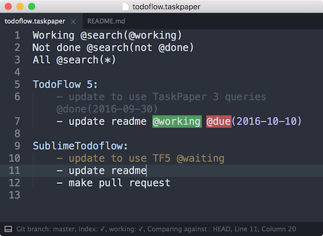
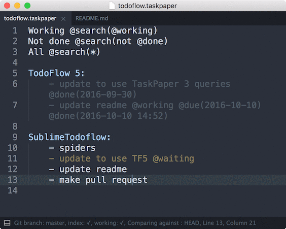
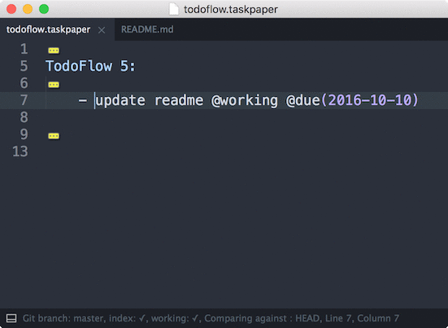
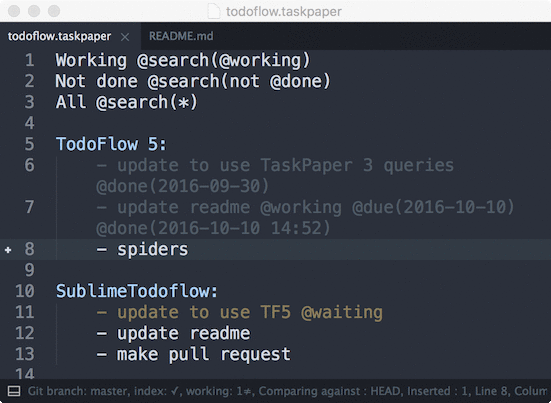

# Sublime Todoflow


Sublime Text 3 package for taskpaper files based on [TodoFlow](https://github.com/bevesce/TodoFlow).

## Features

### Syntex definition

You can change it to highlight your own tags



### Filter

command: `filter`   


### Saved filters

**<kbd>⌘+shift+f</kbd>**, command: `saved_filters`



### Toggle done

**<kbd>⌘+.</kbd>**, command: `toggle_done`



### Move to project

command: `move_to_project`



## Installation

Clone package with submodules into Packages folder and adjusts tags in *SublimeTodoflow.sublime-syntax*.

```
git clone --recursive https://github.com/bevesce/todoflow_sublime.git path/to/Sublime Text 3/Packages/SublimeTodoflow
```

## Requirements/Includes

SublimeTodoflow requires my python package [TodoFlow](https://github.com/bevesce/TodoFlow), it's included in this repo as submodule.
