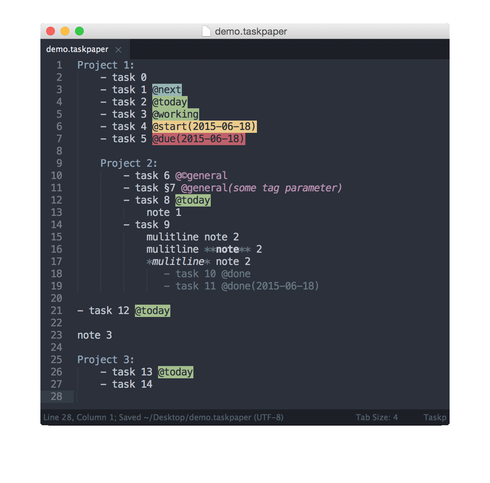

# Sublime Todoflow

Sublime Text 3 plugin for taskpaper filed using [TodoFlow](https://github.com/bevesce/TodoFlow).

#### Filter
#### Saved filters

#### Toggle done
#### Move to project

## Installation

At this moment package is in development and is not included in Package Control, to install it download zip and extract it to `Sublime Text 3/Packages/`

## Requirements/Includes

Plugin requires [ply](https://github.com/dabeaz/ply) and my package [TodoFlow](https://github.com/bevesce/TodoFlow), they are included in this repo as submodules.